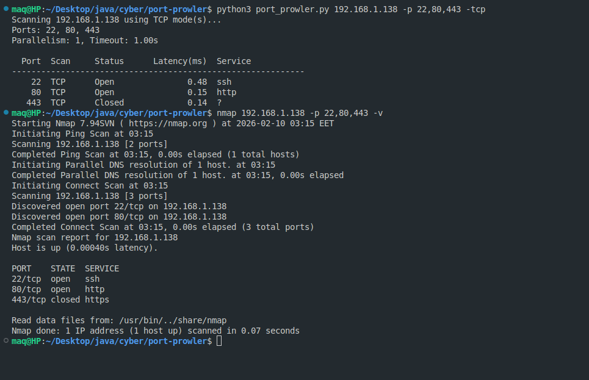
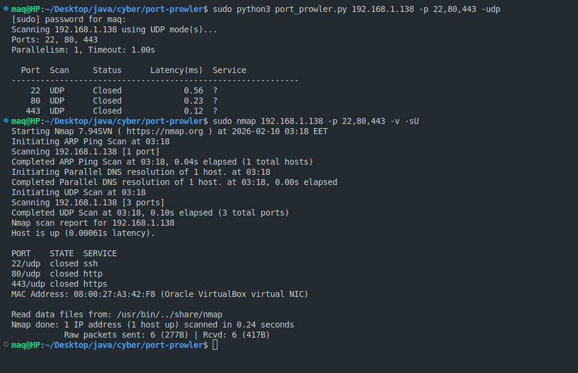
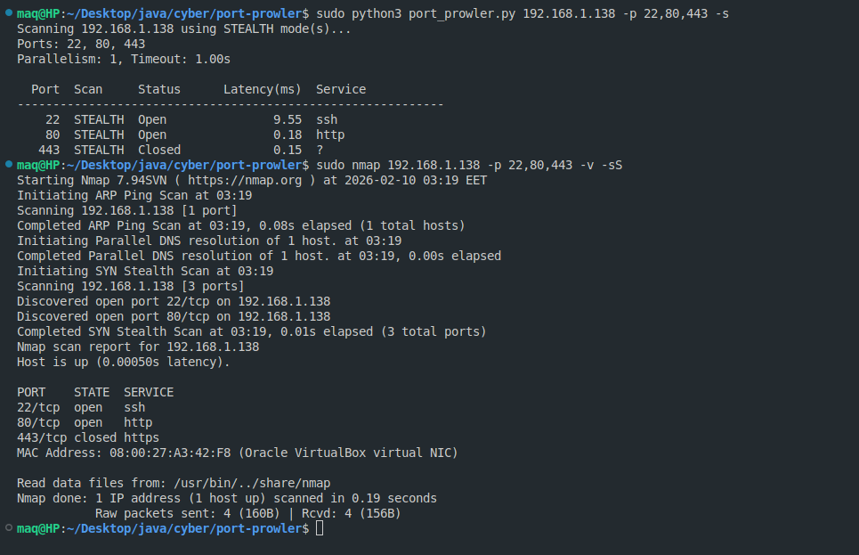

# Verification Screenshots (Nmap vs Port Prowler)

This page provides screenshot proof that Port Prowler matches Nmap results for the same target and ports.

## TCP

Commands:

```bash
python3 port_prowler.py <metasploitable2_ip> -p 22,80,443 -tcp
nmap <metasploitable2_ip> -p 22,80,443 -v
```

Screenshot:



## UDP

Commands:

```bash
python3 port_prowler.py <metasploitable2_ip> -p 22,80,443 -udp
sudo nmap <metasploitable2_ip> -p 22,80,443 -v -sU
```

Screenshot:



## Stealth (SYN)

Commands:

```bash
python3 port_prowler.py <metasploitable2_ip> -p 22,80,443 -s
sudo nmap <metasploitable2_ip> -p 22,80,443 -v -sS
```

Screenshot:



